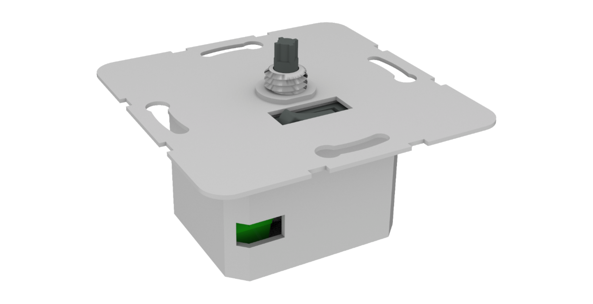
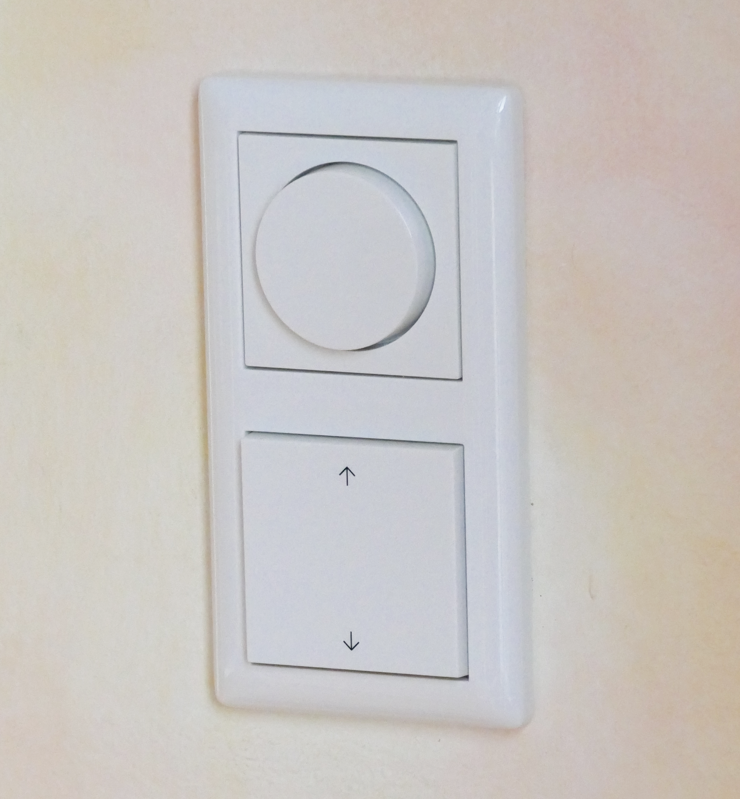
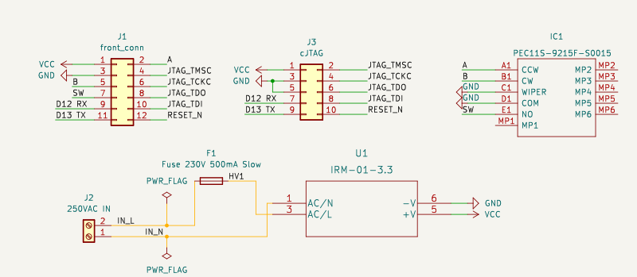
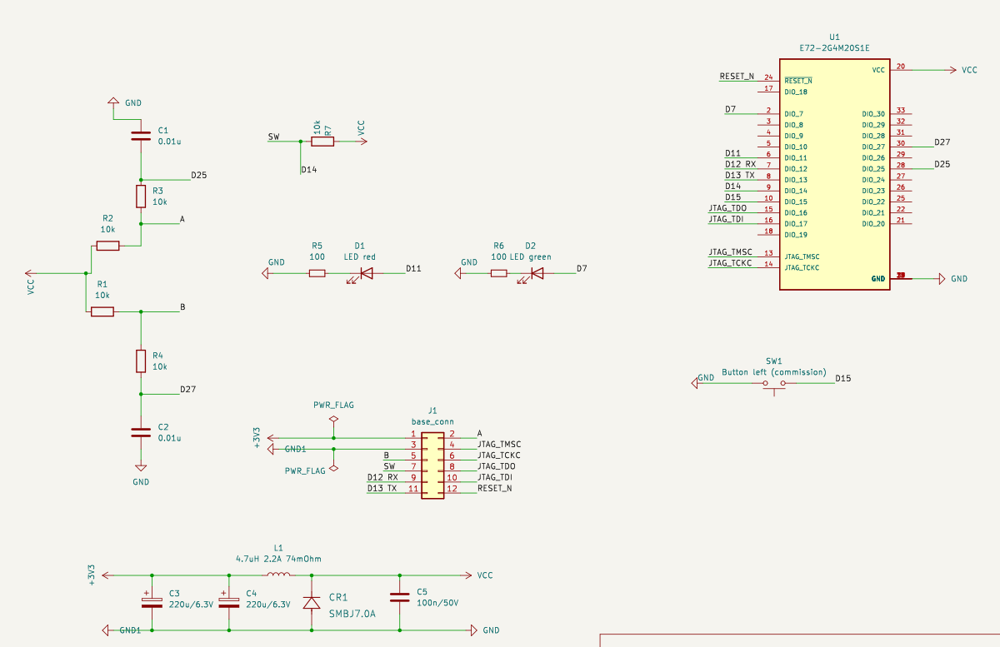

# A rotary Zigbee dimmer switch
A Zigbee dimmer switch with a tactile feeling like classic rotary dimmers that seamlessly integrates with your existing switch and socket design lines (e.g. Gira System 55).

|   |   |
|---|---|

## Use case, requirements, and features
The goal of this dimmer switch is to
* provide tactile feeling like classic rotary dimmers, i.e. rotate and push one big knob (instead of multiple buttons)
* integrate with existing switch and socket design lines (e.g. Gira System 55), also for multi frames
* offer an optional 230V (or 110V) power supply, no more changing batteries + acts as Zigbee router
* control existing smart lights (e.g. Philips Hue), not making classic bulbs smart (i.e. switching/dimming classic bulbs)

Also nice to have:
* be extendable, e.g. easily add multiple dimmer switches or push buttons in multi frames
* allow for a second rotary input by rotating the knob while pushing it (e.g. to change color temperature or scenes)
* feature an integrated 230V (or 110V) mechanical switch to switch power of the connected lamp socket (e.g. for emergencies or to reset the lamp when replacing classic wall switches)
* be affordable

## Backstory: Why yet _another_ Zigbee dimmer switch?
TL;DR; I couldn't find one to fit my use case, so I decided to build my own.

When I moved into my new home I already had many Philips Hue Bulbs and classic Hue dimmer switches (the on with the four buttons) to control the lights.
However, those didn't integrate well with my Gira System 55 outlets, switches, frames, etc. even when using fancy adapters (https://www.samotech.co.uk/products/philips-hue-dimmer-frame-cover-light-switch/)
And I was also a big fan of using a rotary knob for dimming lights, since it is just more convenient.

So why didn't I use available rotary zigbee dimmers? Basically all dimmers I found are "real" dimmers, in the sense that they expect to control a load (classic dimmable bulb) or simply don't fit into the 55mm Gira system.

Since I though "well, it can't be that hard to hook up a rotary encoder to a Zigbee chip", I set out to build a rotary dimmer switch myself.

## Current state of development
I have built an initial prototype which is fully functional and currently in use in my home. 

### Hardware
After some initial exploration using disassembled IKEA tradfri remotes and come XBee controllers, I started working with the TI CC2652P chip using the EBYTE E72-2G4M20S1E module.
I hooked up a rotary encoder to the TI chip on a breadboard and after some testing designed a first board for prototyping.

After designing a simple PCB for testing I quickly realized that the main challenge would be fitting the rather large module, the rotary encoder and the power supply into a box small enough to fit into a flush in-wall box.

#### PCB
For the first prototype I designed two stacked PCBs to have enough space for the large SoC (on the front board) and the rotary encoder in the middle (on the base/back board).

Base:

Front:

Components used to first prototype:

| Component                | Manufacturer                 | Name/Part                               | Details                 |
|--------------------------|------------------------------|-----------------------------------------|-------------------------|
| SoC                      | EBYTE                        | E72-2G4M20S1E                           |                         |
| Rotary encoder           | Bourns                       | PEC11S-929K-S0015                       |                         |
| AC/DC converter          | Mean Well                    | IRM-01-3.3                              | 3.3V 1W                 |
| Fuse                     | Littelfuse Inc.              | F2904CT-ND                              | 500MA 250VAC            |
| Inductor                 | Shenzhen Sunlord Electronics | SWPA5020S4R7MT                          | 4.7UH 2.2A 74MOHM       |
| LED                      | Würth Elektronik             | 150120VS75000                           | Green 1206 SMD          |
| LED                      | Würth Elektronik             | 150120YS75000                           | Yellow 1206 SMD         |
| Cconnector base to front | Amphenol CS                  | 20021321-00012C4LF                      | SMD 12POS 1.27MM Female |
| Cconnector front to base | Amphenol CS                  | 20021121-00012T4LF                      | SMD 12POS 1.27MM Male   |  
| cJTAG connector          | Phoenix Contact              | 1156861                                 | SMD 10POS 1.27MM Male   |
| 230V connector           | Phoenix Contact              | MKDS-1,5-2-5.08_1x02_P5.08mm_Horizontal |                         |      
| Tactile button           | E-Switch                     | EG4344CT-ND                             |                         |

#### Case / adapter
I 3D printed a case to hold the stacked PCBs with a standard wall mounting plate and an adapter to fit the Gira hardware for their standard dimmer component.

The main issue here is that the shaft of rotary encorders seems to be 6mm in diameter while the Gira hardware is made for a potentiometer with a 4mm shaft. So far I have not found a better solution than a 3D printed adapter.

### Software / Firmware

I used the TI simplelink SDK and after some tinkering produced a prototype that would integrate into my homeassistant/deconz system with brightness increase/decrease through rotating the knob and light toggle when pushing it. The Software was straight forward using the SDK. I mapped the pins of the controllers, set up interrupts and wired everything up to send Zigbee commands (pairing etc. is basically provided by SimpleLink SDK). The device could then be paired to a coordinator and send Zigbee commands:

* Level control step (up/down) when rotating left/right
* On/Off Toggle when clicked
* On when long pressed
* Off when double clicked
* Color temperature step (up/down) when pressed and rotated left/right

I then also added two LEDs, one for status and pairing, and one as feedback for actions.

I used the zr_sw example from the SDK with target device CC2652. I didn't make a lot of modifications but I will need to add more details here once I have checked what I am allowed to post here.

## Help wanted
My prototype is working but I see a lot of potential for improvement. Since I am mostly a software engineer with limited knowledge of electronics, I am looking for other interested in taking this project further. You can find me on discord here: https://discord.gg/abkZ47WD

### Goals for improvement & extension

* More compact PCB
  * use TI chip (or other chip) instead of bulky SoC module
  * build battery based variant without converter
* Design extension boards. The MCU offers 26 GPIO pins, of which 12 (or potentially 14-16) can be used for extensions: more dimmer switches or push buttons.
  * 4 GPIOs would be enough to attack a second rotary dimmer module (without additional power or MCU)
  * 1 GPIO would be needed to add a simple switch module next to the dimmer
* Add compatibility for other switch and socket design lines

