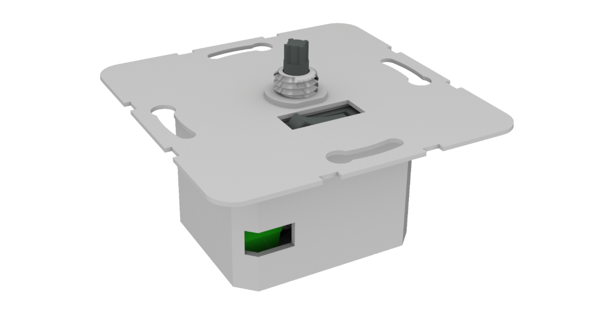
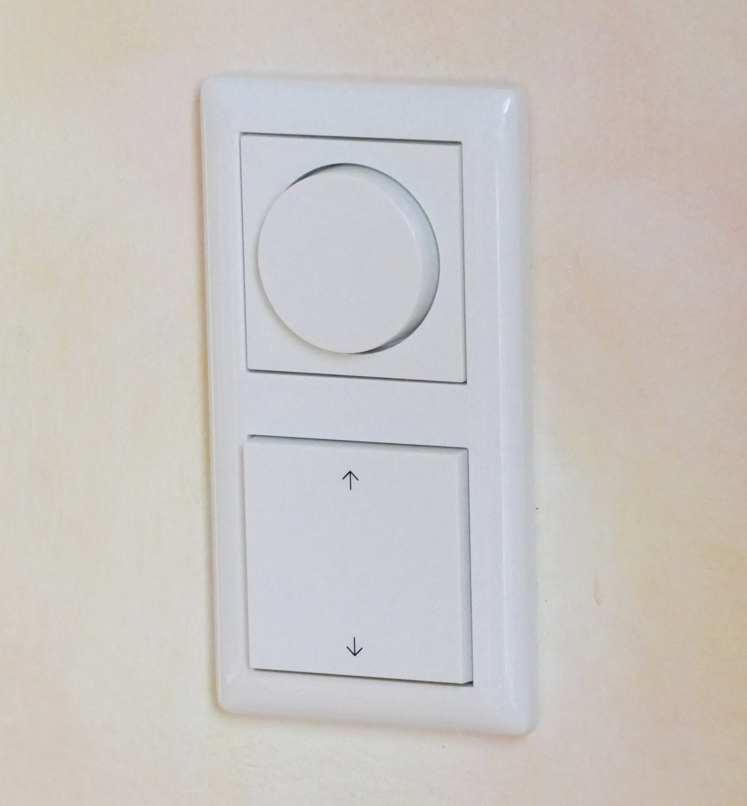

# A rotary Zigbee dimmer switch
A Zigbee dimmer switch with a tactile feeling like classic rotary dimmers that seamlessly integrates with your existing switch and socket design lines (e.g. Gira System 55).

|   |   |
|---|---|

## Use case, requirements, and features
The goal of this dimmer switch is to
* provide tactile feeling like classic rotary dimmers, i.e. rotate and push one big knob (instead of multiple buttons)
* integrate with existing switch and socket design lines (e.g. Gira System 55), also for multi frames
* offer an optional 230V (or 110V) power supply, no more changing batteries + acts as Zigbee router
* control existing smart lights (e.g. Philips Hue), not making classic bulbs smart (i.e. switching/dimming classic bulbs)

Also nice to have:
* be extendable, e.g. easily add multiple dimmer switches or push buttons in multi frames
* ✅ allow for a second rotary input by rotating the knob while pushing it (e.g. to change color temperature or scenes) — _implemented: push + rotate changes color temperature_
* ✅ feature an integrated 230V (or 110V) mechanical switch to switch power of the connected lamp socket (e.g. for emergencies or to reset the lamp when replacing classic wall switches) — _implemented: on-board relay + dedicated button_
* be affordable


## Backstory: Why yet _another_ Zigbee dimmer switch?
TL;DR; I couldn't find one to fit my use case, so I decided to build my own.

When I moved into my new home I already had many Philips Hue Bulbs and classic Hue dimmer switches (the on with the four buttons) to control the lights.
However, those didn't integrate well with my Gira System 55 outlets, switches, frames, etc. even when using fancy adapters (https://www.samotech.co.uk/products/philips-hue-dimmer-frame-cover-light-switch/)
And I was also a big fan of using a rotary knob for dimming lights, since it is just more convenient.

So why didn't I use available rotary zigbee dimmers? Basically all dimmers I found are "real" dimmers, in the sense that they expect to control a load (classic dimmable bulb) or simply don't fit into the 55mm Gira system.

Since I though "well, it can't be that hard to hook up a rotary encoder to a Zigbee chip", I set out to build a rotary dimmer switch myself.


## Current state of development
A working second prototype is built around the **ESP32-C6**. It joins any standard Zigbee coordinator (zigbee2mqtt, Home Assistant ZHA, deCONZ, …) as a mains-powered **Zigbee router** and controls bound smart lights with a single rotary knob. Hardware, firmware, and enclosure design files are all in this repository. It is a DIY prototype, not a finished product — see [Help wanted](#help-wanted).

### Hardware
- **ESP32-C6-MINI** module (Zigbee/Thread radio), programmed/powered over USB-C.
- Integrated **230V → 5V** power supply (IRM-02-5S) plus a 3.3V regulator — no batteries, and it acts as a Zigbee router.
- **Rotary encoder with push** (the single "big knob") for dimming and on/off.
- **WS2812B RGB LED** for status/feedback.
- On-board **230V relay** (on a normally-closed contact) to switch the connected lamp socket directly, with a dedicated button to toggle it.
- A separate commissioning button for pairing / factory reset.
- Designed to fit **Gira System 55** frames.

### Controls
| Input | Action |
| ----- | ------ |
| Rotate knob | Brightness up / down (bound lights) |
| Push knob — short tap | Toggle on / off |
| Push knob — hold | Off |
| Push **and** rotate | Color temperature (warm / cool) |
| Relay button — tap | Cut / restore the 230V outlet (works even with no network) |
| Commission button — tap | Pair (start network steering) |
| Commission button — hold ~5 s | Factory reset (yellow warning while holding, red on reset) |

LED feedback: green = joined · solid red = not connected · white blink = command sent · red blink = command dropped (not joined) · blue blink = relay toggled · yellow = pairing / reset warning.

### Firmware
Built with **ESP-IDF** and the **esp-zigbee-sdk**. From `firmware/`:
```
idf.py set-target esp32c6
idf.py build
idf.py -p <PORT> flash monitor
```
After the first flash, firmware updates are delivered **over the air** (standard Zigbee OTA, with automatic rollback of a bad image). The single source of truth for the version is `firmware/main/version.h`.

### Repository layout
- `hardware/` — KiCad schematics, PCB, and exported gerbers/3D models.
- `firmware/` — ESP-IDF project ([`firmware/docs/OTA.md`](firmware/docs/OTA.md), [`firmware/z2m/README.md`](firmware/z2m/README.md), `firmware/TODO.md`).
- `enclosure/` — printable enclosure / knob design files.

## zigbee2mqtt integration & over-the-air updates
The dimmer joins any standard Zigbee coordinator and exposes two endpoints: a **controller** (endpoint 1) that sends on/off, brightness and color commands to bound lights, and an on-board **230V relay** (endpoint 2) to switch the connected lamp socket directly. It also implements the standard Zigbee OTA Upgrade cluster, so firmware updates are delivered over the air. To add the device to zigbee2mqtt and receive OTA updates from this repo, follow [`firmware/z2m/README.md`](firmware/z2m/README.md). Firmware-side OTA details (partitioning, rollback) are in [`firmware/docs/OTA.md`](firmware/docs/OTA.md).

## Help wanted
My prototype is working but I see a lot of potential for improvement. Since I am mostly a software engineer with limited knowledge of electronics, I am looking for other interested in taking this project further. You can find me on discord here: https://discord.gg/CjbDc5nPja or checkout the discussion here: https://community.home-assistant.io/t/diy-zigbee-rotary-wall-dimmer/681751


